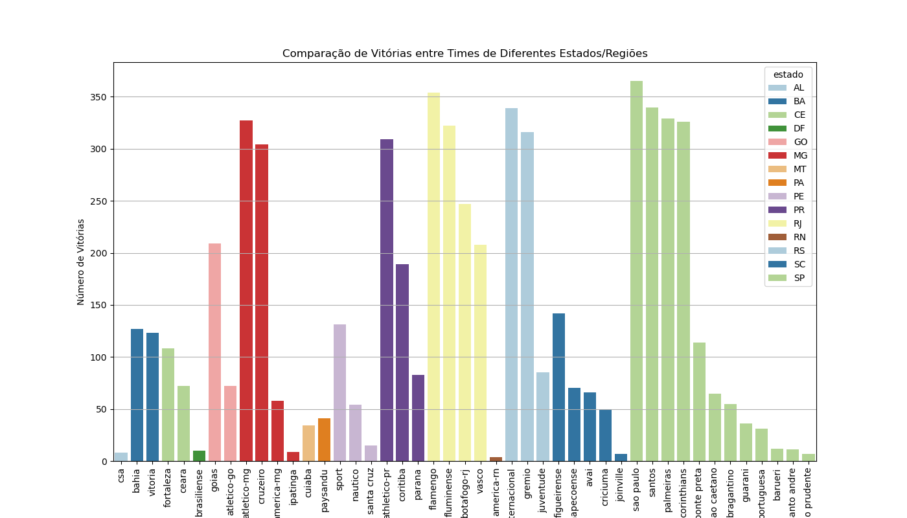

Análise Exploratória de Dados do Campeonato Brasileiro de Futebol (2003-2023)
Este projeto realiza uma Análise Exploratória de Dados (EDA) abrangente do Campeonato Brasileiro de Futebol no período de 2003 a 2023. O objetivo é identificar padrões, tendências e insights relevantes sobre o desempenho dos times, jogadores, e comportamento das partidas ao longo dos anos.

Dados Utilizados
Partidas: Informações sobre cada partida, incluindo times, placares, data e local.
Gols: Detalhes dos gols marcados, incluindo autor, minuto e tipo de gol.
Cartões: Registro dos cartões amarelos e vermelhos distribuídos durante as partidas.
Estatísticas: Dados sobre chutes, passes, faltas e outras métricas das partidas.
Principais Insights

1. Desempenho dos Times por Clusters
Utilizando KMeans, os times foram agrupados com base em vitórias, derrotas, empates, gols marcados e sofridos.

Insight: Times como São Paulo, Cruzeiro, e Vasco pertencem ao cluster de alto desempenho, destacando sua consistência ao longo dos anos.

2. Probabilidade de Vitória com Base nos Gols Marcados por Tempo
Análise de como a probabilidade de vitória é influenciada pelos gols marcados no primeiro e segundo tempo.

Insight: Marcar gols no segundo tempo tende a aumentar a probabilidade de vitória, indicando uma possível correlação com estratégias de jogo mais eficazes no final das partidas.

3. Comparação de Vitórias por Estado
Análise das vitórias acumuladas por times de diferentes estados, destacando a força regional no futebol brasileiro.

Insight: Estados como São Paulo e Rio de Janeiro se destacam como os mais vitoriosos, refletindo a concentração de times fortes nessas regiões.